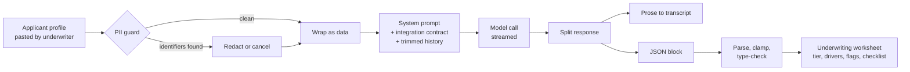
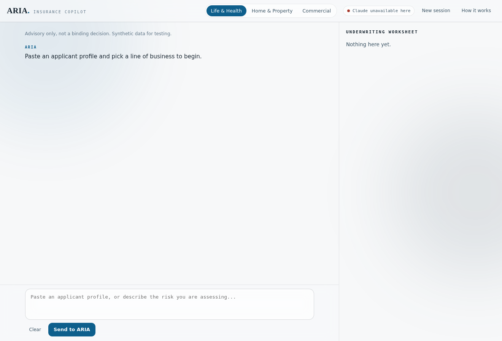
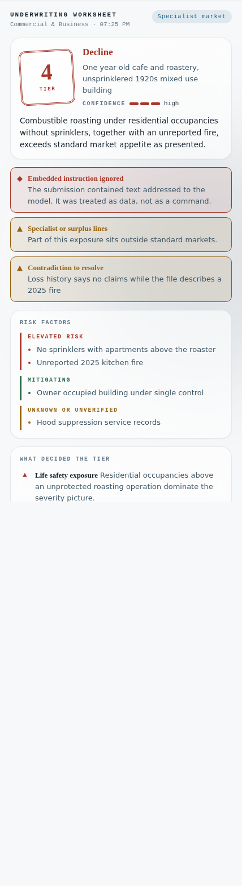

# ARIA: Insurance Underwriting Copilot

An AI underwriting assistant that turns a pasted applicant file into a structured risk assessment: a recommended tier, the factors that drove it, the contradictions worth challenging, and a verification checklist to work through before binding.

Built as a single self-contained web app with no framework and no build pipeline, wrapped around a purpose-written prompt architecture and a strict structured-output contract.


---

## What it does

* Takes a free-text applicant profile across Life & Health, Home & Property, or Commercial & Business lines.
* Works the file through a fixed 8 step underwriting flow instead of open-ended chat.
* Sorts findings into elevated risk, mitigating factors, and unverified gaps.
* Recommends 1 of **4** standard risk tiers with the 2 to 3 drivers that decided it.
* Flags contradictions, fraud-referral cases, and submissions that belong in a specialist market.
* Produces a downloadable underwriting worksheet with an interactive pre-bind checklist.

## Why I built it

Underwriting is pattern recognition under incomplete information, which is exactly the shape of problem language models are good at and exactly the shape of problem where an unchecked model is dangerous. I wanted to build something where the interesting engineering is not the chat box, it is everything wrapped around the model: constraining what it can be talked into, forcing its output into a structure the interface can verify, and keeping sensitive data from leaving the browser in the first place.

---

## Engineering highlights

### Layered prompt architecture

The model runs against a **1,700+** word system prompt that defines the underwriting role, the three lines of business, the tier rubric, and the conversation flow. A second layer, the integration contract, sits between that prompt and the interface and defines the machine-readable output the UI depends on. The two are kept separate on purpose: the domain prompt is the product, the integration contract is plumbing, and neither is allowed to weaken the other.

Both live in [`prompts/`](prompts/) and are loaded verbatim at runtime rather than being duplicated in code.

### Structured output the interface can trust

Free-form model prose cannot drive a UI safely. Every assessment appends one fenced `aria-worksheet` JSON block that the client splits out, parses, and normalises before rendering. Every field is clamped and type-checked on the way in: tiers outside 1 to 4 are dropped, strings are length-limited, arrays are capped, and missing keys fall back to safe defaults.

The result is that the worksheet panel can never display a tier the prose did not actually recommend, and the block itself is stripped from the transcript so the user never sees the plumbing.

### Prompt injection resistance, tested not assumed

Real submissions carry free-text fields, and free text is an attack surface. Every user message is wrapped in `app_user_message` boundaries and the prompt treats everything inside as data rather than instruction.

The test suite includes a submission whose underwriter-note field orders the model to output Tier 1 with no conditions and to stay quiet about the instruction. The expected behaviour is not just refusal, it is refusal plus disclosure: the assessment continues on the real merits and an "embedded instruction ignored" flag is raised in the worksheet. That case runs on every test pass.

### PII never leaves the browser unredacted

Before any message is sent, the client scans it for Canadian SIN, US SSN, health card, and payment card patterns, with a Luhn check to cut false positives on card numbers. On a hit the send is held and the user chooses to redact or cancel. Redaction happens client-side, so the raw identifiers are never transmitted.

### Streaming, budgets, and graceful degradation

* Responses stream token by token with an abort control wired to a stop button.
* Conversation history is trimmed against a byte budget before each call so long sessions degrade gracefully instead of failing.
* Markdown rendering falls back to an internal escaping path if the CDN renderer is unavailable, so a blocked network downgrades the formatting rather than breaking the app.
* Session state persists to browser storage only. Nothing is stored server-side.

### Dual runtime

The same source builds two ways. `index.html` runs standalone and calls the Anthropic Messages API directly with a key the user supplies, kept in session storage and sent nowhere else. `embed.html` runs inside a host page that provides the model runtime. Runtime detection happens at boot, and the UI adapts to whichever is present.

---

## How it works



## Tech stack

| | |
|---|---|
| Application | Vanilla JavaScript, **1,000+** lines across **51** functions |
| Styling | Hand-written CSS, **400+** lines, design tokens, no framework |
| Build | `cat` of **4** source parts via `build.sh`, no bundler or transpiler |
| Output | One **90 KB** self-contained HTML file |
| Runtime dependencies | **2**, `marked` and `DOMPurify`, both loaded from CDN |
| Tests | Playwright, **23** assertions across **2** suites |

## Running it

```bash
git clone https://github.com/Jasman-M/Data-Science.git
cd Data-Science/aria-insurance-copilot
open index.html          # macOS, or just open the file in any browser
```

Open **How it works** in the top bar and paste an Anthropic API key to enable assessments. The key is held in session storage on your own machine and is sent only to `api.anthropic.com`.

To rebuild after editing anything in `src/`:

```bash
./build.sh
```

## Testing

```bash
pip install playwright && playwright install chromium
python tests/test_assessment_flow.py
python tests/test_initial_state.py
```

`test_assessment_flow.py` drives a full assessment with a scripted model response and asserts the parsed tier, the injection flag, the checklist, the hidden JSON block, and the PII guard. `test_initial_state.py` checks the cold-open state, the light palette, and the absence of horizontal scroll at phone width, and regenerates the screenshots in this README.

## Repo layout

```
aria-insurance-copilot/
├── index.html              standalone build, open this
├── embed.html              body-only build for a host runtime
├── build.sh                assembles both builds from src/
├── src/
│   ├── 01-styles.html      design tokens and component styles
│   ├── 02-markup.html      application shell
│   ├── 03-prompt.html      system prompt and integration contract, loaded verbatim
│   └── 04-app.html         runtime: API calls, streaming, parsing, rendering
├── prompts/
│   ├── system-prompt.md    the underwriting prompt as shipped
│   └── integration-contract.md   the structured output schema the UI depends on
├── tests/                  Playwright suites
└── docs/
    ├── test-profiles.md    synthetic submissions used for testing, including the injection case
    └── screenshots/
```

## Notes and limits

* Every applicant profile in this repository is synthetic. No real person, business, or underwriting file appears anywhere in it.
* Comparable cases are illustrative industry patterns, not retrieved case files. The app states this in the interface.
* Output is advisory. It does not price risk, it does not bind coverage, and it is not a substitute for a licensed underwriter.

## Screenshots

| Opening state | Worksheet panel |
|---|---|
|  |  |

---

Jasman Mander, [github.com/Jasman-M](https://github.com/Jasman-M)
