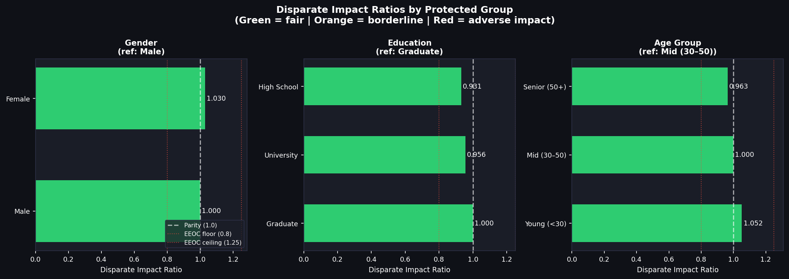
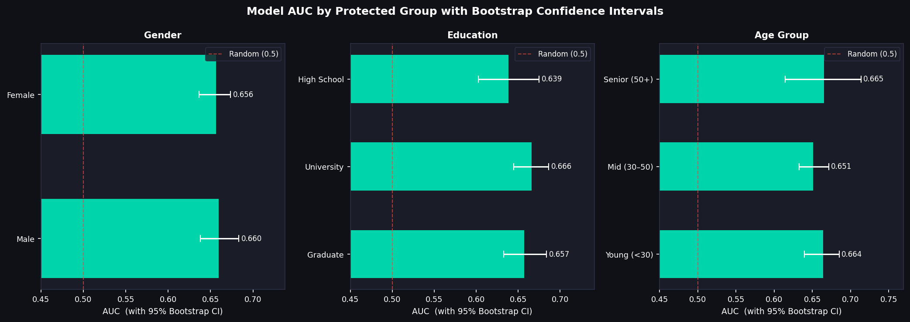
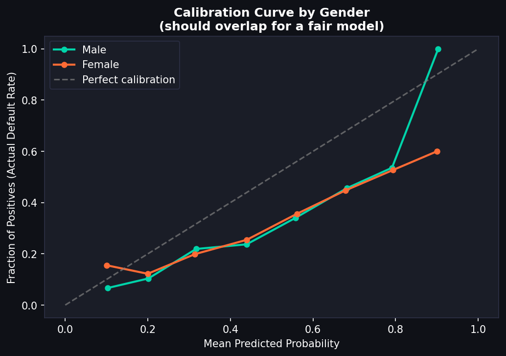

# Statistical Fairness Audit for Credit Models


> Auditing a production ML credit model for demographic bias — using the same statistical framework regulators expect under ECOA and the Fair Housing Act.

A credit model can be accurate on average and still systematically disadvantage certain groups. This tool measures *whether* that's happening and *how severely*, across three protected attributes simultaneously.

---

## Fairness Metrics

| Metric | What It Tests | Flag Threshold |
|---|---|---|
| **Disparate Impact Ratio** | Approval rate ratio vs reference group (EEOC 4/5 rule) | DIR < 0.80 |
| **Equal Opportunity Difference** | Gap in True Positive Rate across groups | \|EOD\| > 0.05 |
| **Predictive Equality Difference** | Gap in False Positive Rate across groups | \|PED\| > 0.05 |
| **Calibration** | Does a 70% risk score mean 70% actual defaults, for every group? | Visual + bins |
| **Bootstrap AUC CI** | Group-level AUC with 95% confidence intervals (500 resamples) | Overlap check |
| **Chi-square test** | Statistical independence between group and model predictions | p < 0.05 |

**Groups audited:** Gender (Male/Female) · Education (Graduate/University/High School) · Age (< 30 / 30–50 / 50+)

---

## Results

### Disparate Impact Ratio by Group
*Ratios below the red threshold (0.80) violate the EEOC 4/5 rule — a legal standard in fair lending.*



---

### AUC by Group with 95% Bootstrap Confidence Intervals
*500 bootstrap resamples per group. Non-overlapping intervals signal statistically meaningful performance gaps.*



---

### Score Calibration by Gender
*A well-calibrated model predicts 70% default risk only for borrowers who actually default ~70% of the time — and equally so across groups.*



---

## Run It

```bash
pip install xgboost scikit-learn pandas numpy matplotlib seaborn
python fairness_audit.py
```

Self-contained — generates synthetic data and trains the model internally. All charts saved to `outputs/`.

---

## Key Insight

Fairness is multidimensional. A model can pass the 4/5 rule on denial rates while still showing meaningful True Positive Rate gaps — meaning qualified borrowers from certain groups are disproportionately rejected. This audit flags all three axes independently, matching the multi-metric approach regulators increasingly require.

---

**Author:** Jasman Mander · [GitHub](https://github.com/Jasman-M)
