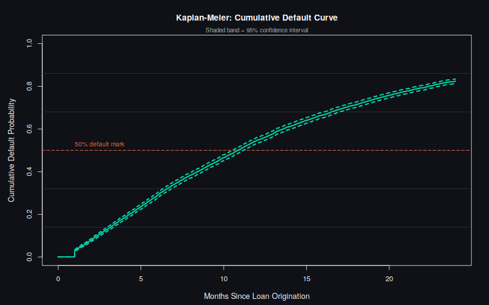
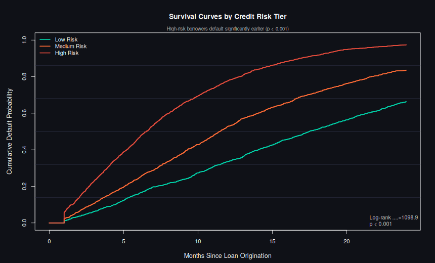
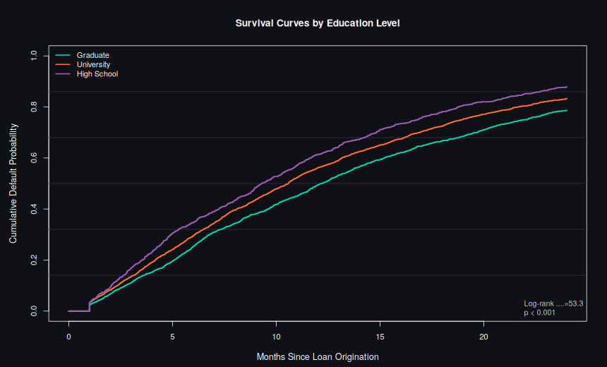
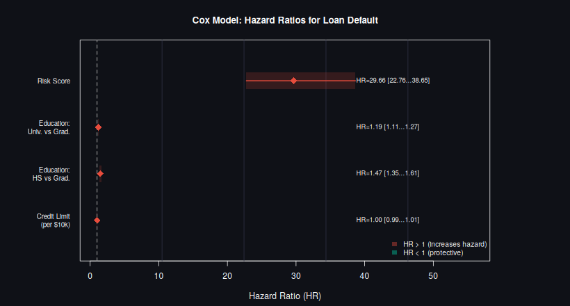
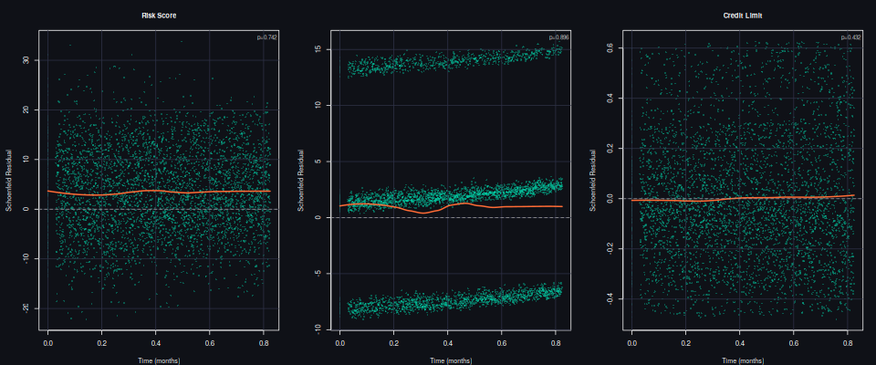

# Loan Default Survival Analysis


> Modelling *when* borrowers default — not just *whether* — using Kaplan-Meier estimation, log-rank tests, and Cox Proportional Hazards regression on a synthetic cohort of **5,000 borrowers** tracked over **24 months**.

Most credit models treat a 3-month default and a 23-month default identically. Survival analysis distinguishes them — and handles **censoring** correctly, so borrowers who haven't defaulted yet still contribute information rather than being discarded.

---

## Models

### Kaplan-Meier Estimator (Non-Parametric)

Estimates the probability of surviving (not defaulting) at each point in time. Computed for the full cohort and stratified by risk tier and education level. All group differences confirmed significant via log-rank test (p < 0.001).

### Overall Survival Curve



---

### Survival by Risk Tier



---

### Survival by Education Level



---

### Cox Proportional Hazards Model (Semi-Parametric)

Estimates the effect of each covariate on *default hazard* — the instantaneous rate of defaulting at any given time.

| Covariate | Hazard Ratio | Interpretation |
|---|---|---|
| `risk_score` | **29.66** | Dominant predictor of default timing |
| Education: University vs Graduate | **1.19** | Uni grads default 19% faster |
| Education: High School vs Graduate | **1.47** | HS borrowers default 47% faster |
| `credit_limit` | 1.00 | No significant effect on timing |

**C-index: 0.66** (0.50 = random, 1.0 = perfect)



---

### Proportional Hazards Diagnostics

Schoenfeld residual test confirms the PH assumption holds for all covariates (global p = 0.65) — meaning hazard ratios are stable over time, not just early or late in the observation window.



---

## Run It

```bash
Rscript survival_analysis.R
```

Requires only base R and the `survival` package, which ships with every R installation — no dependencies to install.

---

## Why This Matters for Lending

A lender pricing a **12-month** loan product needs to know the 12-month survival probability specifically, not a lifetime default rate. KM curves answer exactly that. Cox regression then isolates which borrower characteristics accelerate or delay default — giving underwriters an interpretable, time-aware risk model.

---

**Author:** Jasman Mander · [GitHub](https://github.com/Jasman-M)
